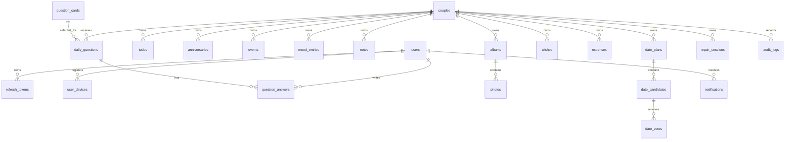

# PairFlow Data Model

PairFlow stores one private workspace per active couple. Most domain tables are couple-scoped and must be guarded by `CoupleContext` or equivalent membership checks.

## Global Conventions

- Primary keys are UUID strings stored as `varchar(36)`.
- Common entity fields come from `BaseEntity`:
  - `id`
  - `created_at`
  - `updated_at`
- Java enums are stored as strings.
- PostgreSQL + Flyway is the default schema path.
- H2 exists as a local fallback profile.
- App-local date logic uses `Asia/Taipei`.

## Relationship Overview

## Users And Auth

### `users`

Purpose: application user account.

Important fields:
- `email`
- `display_name`
- `password_hash`
- `timezone`

Rules:
- `email` is unique.
- Passwords are BCrypt hashes.
- A user may belong to only one active couple.

### `refresh_tokens`

Purpose: long-lived refresh token tracking.

Important fields:
- `user_id`
- `token_hash`
- `expires_at`
- `revoked_at`

Rules:
- Raw refresh tokens are not stored.
- Logout revokes refresh tokens.

### `user_devices`

Purpose: push notification device registration.

Important fields:
- `user_id`
- `platform`
- `token`

Rules:
- Device tokens belong to one user.
- Removing a device stops push delivery to that device.

## Couple And Pairing

### `couples`

Purpose: active or ended pair workspace.

Important fields:
- `user_a_id`
- `user_b_id`
- `relationship_start_date`
- `status`
- `data_handling`

Rules:
- `daysTogether` is derived, not stored.
- `daysTogether` is inclusive: relationship start date is day 1.
- Couple membership is the root authorization boundary.

### `couple_invites`

Purpose: invite-code pairing.

Important fields:
- `code`
- `created_by`
- `expires_at`
- `status`

Rules:
- `code` is unique.
- Invite expires after TTL.
- Joining is rejected if user is already actively coupled.

### `pending_breakups`

Purpose: two-step breakup confirmation.

Important fields:
- `couple_id`
- `initiated_by`
- `data_handling`
- `expires_at`
- `confirmed`
- `cancelled`

Rules:
- Initiator creates pending breakup.
- Partner confirms before expiry.
- Request can be cancelled before confirmation.

## Todos

### `todos`

Purpose: couple tasks and shared goals.

Important fields:
- `couple_id`
- `title`
- `description`
- `type`
- `status`
- `priority`
- `due_date`
- `created_by`
- assignee flags/options
- surprise visibility fields
- goal target/current/unit fields

Rules:
- Every todo belongs to a couple.
- Surprise todos are hidden from partner in list and direct fetch until visible/unlocked.
- Undated todos support "想到再做".

### `todo_checklist_items`

Purpose: subtasks under a todo.

Important fields:
- `todo_id`
- `title`
- `completed`
- `sort_order`

Rules:
- Access inherits from parent todo.

### `todo_comments`

Purpose: comments under a todo.

Important fields:
- `todo_id`
- `author_id`
- `content`

Rules:
- Access inherits from parent todo.

## Calendar And Anniversaries

### `anniversaries`

Purpose: important dates and countdowns.

Important fields:
- `couple_id`
- `title`
- `date`
- `repeat_type`
- `reminder_days_before_csv`
- `created_by`

Rules:
- `daysLeft` and next occurrence are derived.
- Repeat type determines next occurrence.

### `events`

Purpose: shared calendar events.

Important fields:
- `couple_id`
- `title`
- `description`
- `event_type`
- `start_time`
- `end_time`
- location and date-specific metadata

Rules:
- Query by date range.
- Date planner finalization can create events.

## Mood

### `mood_entries`

Purpose: daily mood check-in.

Important fields:
- `couple_id`
- `user_id`
- `mood`
- `emoji`
- `note`
- `need_response`

Rules:
- Partner mood appears on home.
- Mood data is couple-private.

### `mood_reactions`

Purpose: quick partner responses.

Important fields:
- `mood_entry_id`
- `user_id`
- `reaction`

Rules:
- Access inherits from mood entry.

## Notes And Future Letters

### `notes`

Purpose: notes, small letters, and timed future letters.

Important fields:
- `couple_id`
- `sender_id`
- `receiver_id`
- `type`
- `title`
- `content`
- `unlock_time`
- `read_at`
- `favorite`

Rules:
- Future letters cannot be read by receiver before `unlock_time`.
- Sender and receiver visibility rules depend on note type.
- Notes are scoped to the couple.

## Albums And Media

### `albums`

Purpose: group photos.

Important fields:
- `couple_id`
- `title`
- `description`

Rules:
- Only couple members can list or mutate albums.

### `photos`

Purpose: photo metadata.

Important fields:
- `couple_id`
- `album_id`
- `image_url`
- `caption`
- `taken_at`
- `uploaded_by`

Rules:
- Photo media is served through `/api/media`.
- Media endpoint must enforce couple membership.
- Local filesystem storage is development-only until object storage is added.

## Daily Questions

### `question_cards`

Purpose: global question catalog.

Important fields:
- `text`
- `category`
- `sensitivity`

Rules:
- Global catalog, not couple-specific.
- Seeder tops up catalog to 1000 cards.

### `daily_questions`

Purpose: one assigned question for a couple on a date.

Important fields:
- `couple_id`
- `question_card_id`
- `date`
- `is_favorite`

Rules:
- Unique constraint: `unique(couple_id, date)`.
- Same couple/date receives stable question.
- Favorite belongs to the daily question instance.

### `question_answers`

Purpose: one user's answer to a daily question.

Important fields:
- `daily_question_id`
- `user_id`
- `answer`

Rules:
- Unique constraint: `unique(daily_question_id, user_id)`.
- Partner answer is hidden until both partners have answered.

## Future Together / Wishes

### `wishes`

Purpose: shared future experiences and goals.

Important fields:
- `couple_id`
- `title`
- `description`
- `category`
- `status`
- `target_note`
- `created_by`
- `completed_by`
- `completed_at`
- `converted_todo_id`

Rules:
- Active wishes appear on home.
- Wish can be converted to todo once.
- Completed wishes contribute to progress.

## Finance

### `expenses`

Purpose: lightweight couple expense records.

Important fields:
- `couple_id`
- `title`
- `amount`
- `currency`
- `paid_by`
- `split_type`
- `category`
- `spent_at`

Rules:
- Finance is tracking, not settlement enforcement.
- Summary is derived from expenses.

## Date Planning

### `date_plans`

Purpose: planning container for a date.

Important fields:
- `couple_id`
- `created_by`
- `title`
- `date_type`
- `budget_level`
- `area`
- `duration_hours`
- `status`
- `chosen_candidate_id`
- `scheduled_event_id`

Rules:
- Plan starts as planning and can be finalized.
- Finalized plan can create event and prep todos.

### `date_candidates`

Purpose: candidate options inside a date plan.

Important fields:
- `plan_id`
- `title`
- `description`
- `location`
- `added_by`

Rules:
- Access inherits from date plan.

### `date_votes`

Purpose: one user's vote on a candidate.

Important fields:
- `candidate_id`
- `user_id`
- `vote`

Rules:
- Unique constraint: `unique(candidate_id, user_id)`.

## Repair

### `repair_sessions`

Purpose: conflict repair workflow.

Important fields:
- `couple_id`
- `created_by`
- `state`
- `status`
- `raw_message`
- `softened_message`
- `response_type`
- `response_text`
- follow-up task data

Rules:
- AI softening is safety-guarded.
- Flagged content should surface help resources and avoid unsafe generation.

## Notifications And Audit

### `notifications`

Purpose: in-app notification feed.

Important fields:
- `user_id`
- `type`
- `title`
- `body`
- `read_at`
- related entity fields

Rules:
- Notifications are per user.
- Unread count is derived.

### `notification_preferences`

Purpose: per-user notification type preferences.

Important fields:
- `user_id`
- disabled notification types

Rules:
- Unique per user.

### `audit_logs`

Purpose: sensitive operation history.

Important fields:
- `actor_id`
- `couple_id`
- `action`
- `target_type`
- `target_id`
- metadata

Rules:
- Important relationship and privacy operations should be audit logged.

## Core Invariants

- A couple-scoped record must not be returned to non-members.
- One user cannot have more than one active couple.
- Relationship day count is inclusive.
- Daily question answers unlock only after both partners answer.
- Surprise tasks are invisible to the partner until visible/unlocked.
- Future letters are hidden before unlock time.
- Media requires auth and couple membership.
- Auth tokens and refresh tokens must not expose password hashes.

