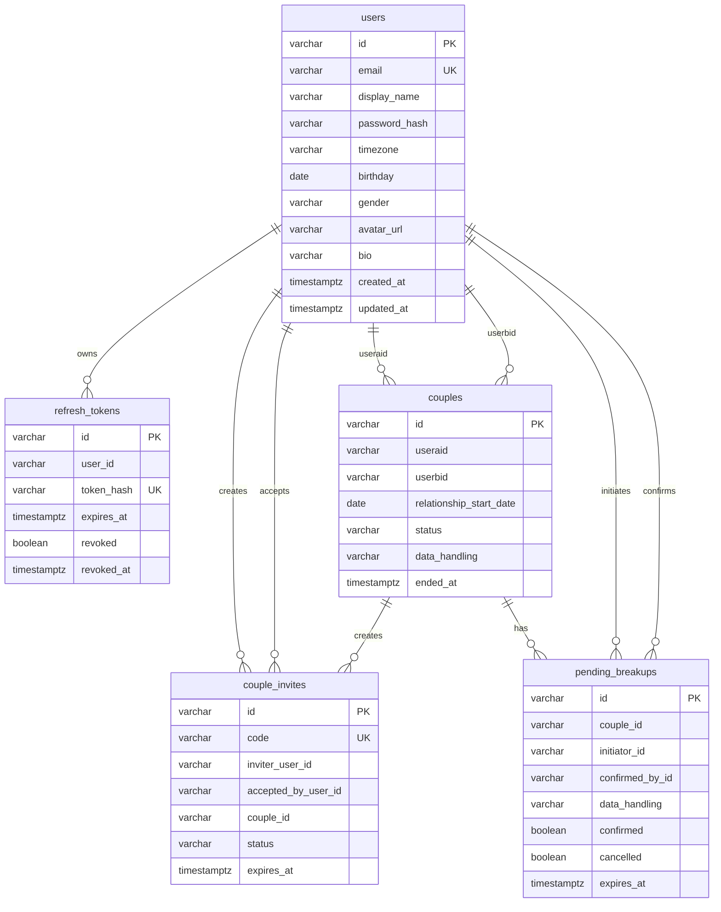
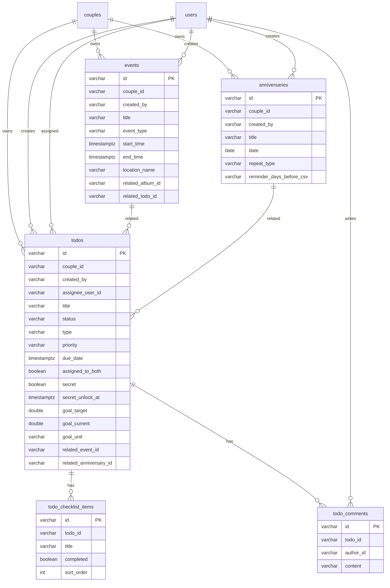
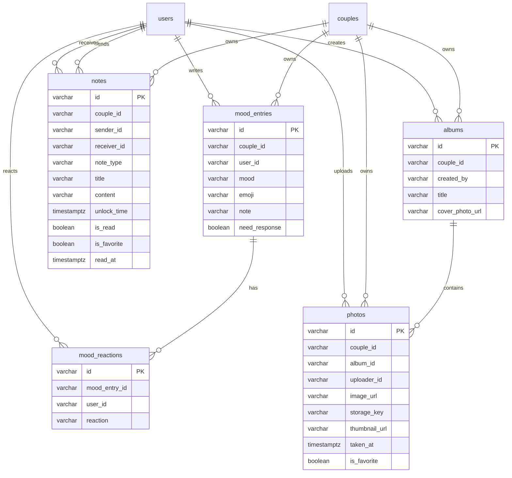
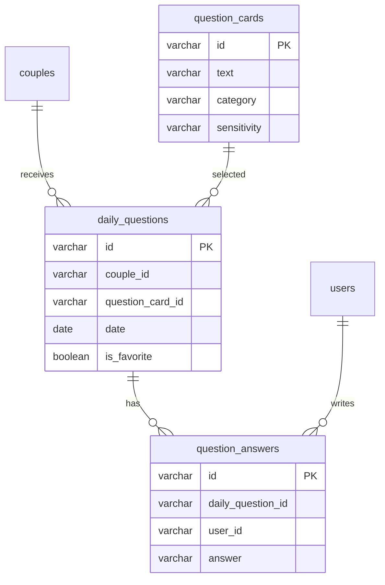
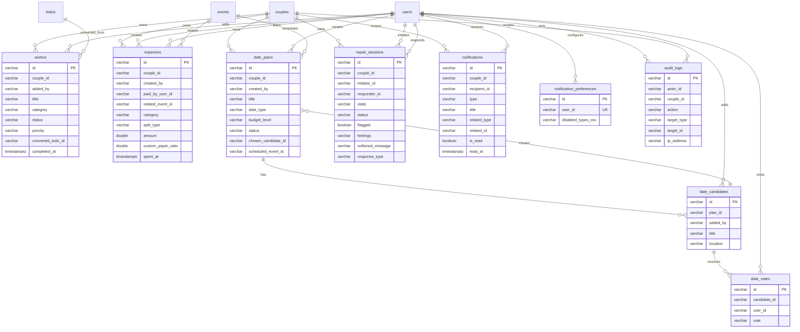

# PairFlow ER Model

This ER model is generated from the current `pairflow` PostgreSQL schema plus logical relationships inferred from column names and application code.

Important note: the current database has primary keys and unique constraints, but no physical foreign key constraints. The relationships below are logical application-level relationships.

## Core Relationship Map

```mermaid
erDiagram
  users ||--o{ refresh_tokens : "user_id"
  users ||--o{ user_devices : "user_id"
  users ||--o{ notification_preferences : "user_id"
  users ||--o{ notifications : "recipient_id"
  users ||--o{ audit_logs : "actor_id"

  users ||--o{ couples : "useraid"
  users ||--o{ couples : "userbid"
  users ||--o{ couple_invites : "inviter_user_id"
  users ||--o{ couple_invites : "accepted_by_user_id"
  couples ||--o{ couple_invites : "couple_id"
  couples ||--o{ pending_breakups : "couple_id"
  users ||--o{ pending_breakups : "initiator_id"
  users ||--o{ pending_breakups : "confirmed_by_id"

  couples ||--o{ todos : "couple_id"
  users ||--o{ todos : "created_by"
  users ||--o{ todos : "assignee_user_id"
  todos ||--o{ todo_checklist_items : "todo_id"
  todos ||--o{ todo_comments : "todo_id"
  users ||--o{ todo_comments : "author_id"

  couples ||--o{ anniversaries : "couple_id"
  users ||--o{ anniversaries : "created_by"
  couples ||--o{ events : "couple_id"
  users ||--o{ events : "created_by"
  events ||--o{ todos : "related_event_id"
  anniversaries ||--o{ todos : "related_anniversary_id"

  couples ||--o{ mood_entries : "couple_id"
  users ||--o{ mood_entries : "user_id"
  mood_entries ||--o{ mood_reactions : "mood_entry_id"
  users ||--o{ mood_reactions : "user_id"

  couples ||--o{ notes : "couple_id"
  users ||--o{ notes : "sender_id"
  users ||--o{ notes : "receiver_id"

  couples ||--o{ albums : "couple_id"
  users ||--o{ albums : "created_by"
  albums ||--o{ photos : "album_id"
  couples ||--o{ photos : "couple_id"
  users ||--o{ photos : "uploader_id"

  question_cards ||--o{ daily_questions : "question_card_id"
  couples ||--o{ daily_questions : "couple_id"
  daily_questions ||--o{ question_answers : "daily_question_id"
  users ||--o{ question_answers : "user_id"

  couples ||--o{ wishes : "couple_id"
  users ||--o{ wishes : "added_by"
  todos ||--o{ wishes : "converted_todo_id"

  couples ||--o{ expenses : "couple_id"
  users ||--o{ expenses : "created_by"
  users ||--o{ expenses : "paid_by_user_id"
  events ||--o{ expenses : "related_event_id"

  couples ||--o{ date_plans : "couple_id"
  users ||--o{ date_plans : "created_by"
  date_plans ||--o{ date_candidates : "plan_id"
  users ||--o{ date_candidates : "added_by"
  date_candidates ||--o{ date_votes : "candidate_id"
  users ||--o{ date_votes : "user_id"
  date_candidates ||--o{ date_plans : "chosen_candidate_id"
  events ||--o{ date_plans : "scheduled_event_id"

  couples ||--o{ repair_sessions : "couple_id"
  users ||--o{ repair_sessions : "initiator_id"
  users ||--o{ repair_sessions : "responder_id"

  couples ||--o{ notifications : "couple_id"
  couples ||--o{ audit_logs : "couple_id"
```

## Auth And Couple

## Daily Work And Calendar

## Emotional And Memory Layer

## Daily Questions

Constraints:
- `daily_questions`: `unique(couple_id, date)`
- `question_answers`: `unique(daily_question_id, user_id)`
- `question_cards` is a global catalog, currently seeded to 1000 cards.

## Planning, Money, Repair, Notification

Constraints:
- `date_votes`: `unique(candidate_id, user_id)`
- `notification_preferences`: `unique(user_id)`
- `users`: `unique(email)`
- `couple_invites`: `unique(code)`
- `refresh_tokens`: `unique(token_hash)`

